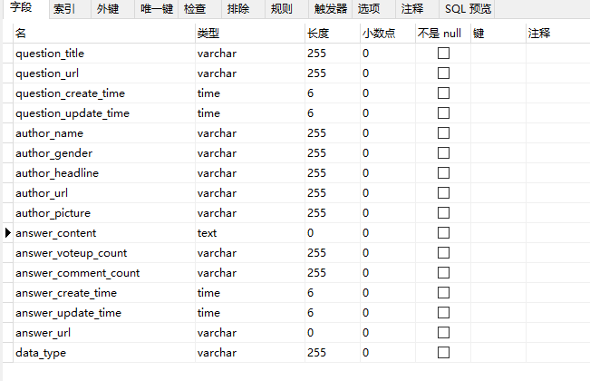
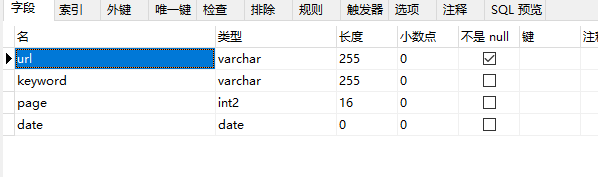
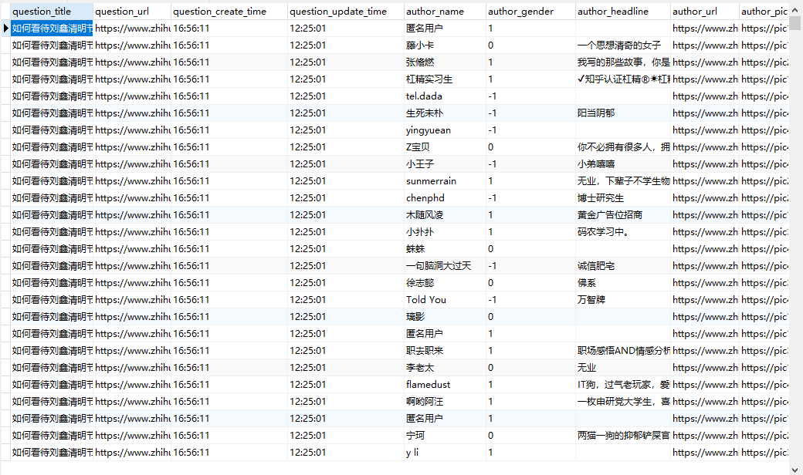

知乎
=============

实现模拟登录  根据搜索的关键词爬取相关信息  
------------------------------
-   获取所有问题相关信息 （问题类型，问题描述，问题URL，问题创建时间，问题描述时间）
-   获取问题下的所有回答 （回答URL，回答赞同数，回答评论数，回答内容，回答创建时间，回答更新时间）
-   获取所有回答者的用户信息 （用户URL，用户名称，用户头像地址，用户签名，用户性别）

-----

###1.配置 ###

**a.  实例化 ZhiHu 类** 

`zhihu = ZhiHu(phone,password,username,keyword,conn,cur)`
>需要配置账号信息：手机号，密码，用户名

>需要配置搜索信息信息： 关键词

>需要配置数据库连接存储信息： 

**b. 数据库表字段** 

######zhihu_answer 表格字段 #######

######zhihu_question_id 表格字段  #######

###2.获取关键词相关问题URL列表存储到数据库  #######

`url_list = zhihu.get_information_id()`

###3.从数据库中筛选获取相关问题URL列表  #######

避免重复爬取

出错后可由数据库中直接筛选问题url

###4.爬取信息  #######

`zhihu.get_information(url)`

###5.结果示例  #######

